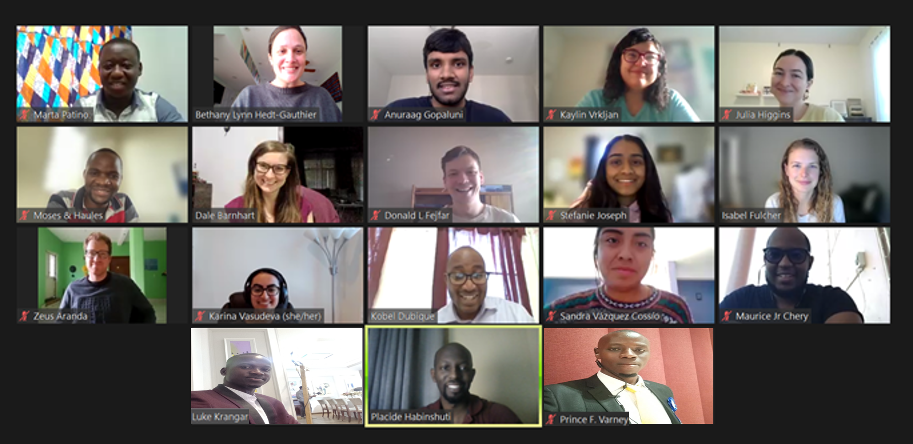
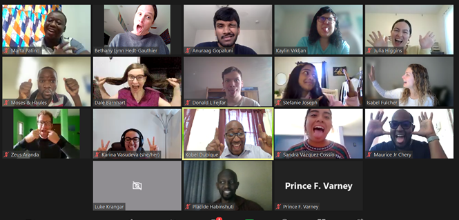

# PIH Cross-site COVID-19 Writing Workshop
This website houses materials for the January 2022 Partners In Health Cross-site COVID-19 Writing Workshop. The goal is to take participants from their proposed COVID-19-related research projects to a ready-to-submit manuscript in one week of full workshop days consisting of both working sessions and lectures. This writing training utilizes teams of senior mentors with extensive research experience, research assistants to support the project, and course participants with data, project ideas, and working expertise. The teams and projects can be found in [this spreadsheet](Writing-Workshop-Teams.xlsx). Questions about this course may be directed to dfejfar@pih.org.

The shareable link to this site is: [https://donald-fejfar.github.io/Cross-Site-Writing-Workshop/](https://donald-fejfar.github.io/Cross-Site-Writing-Workshop/).

The shareable link to team progress reports can be found here: [https://docs.google.com/spreadsheets/d/1HRUquJbXyzWZdKR0A1IklwUC0YaBSg07B1mNBDO9rp4/edit?usp=sharing](https://docs.google.com/spreadsheets/d/1HRUquJbXyzWZdKR0A1IklwUC0YaBSg07B1mNBDO9rp4/edit?usp=sharing).

 

# Schedule
The schedule, including the times of sessions in different time zones, Zoom details, and the schedule of content (lectures and workshop), can be [found here](CovCo_writing_workshop_scheduleonly.xlsx). This schedule consists primarily of three chunks of time: Blue (Early), Green, and Yellow (Late). The Green sessions are a consistent time shared between all participants, where all team members from all teams are expected to be in attendance. The Blue and Yellow sessions are extra workshopping times to get daily tasks done, and teams should attend based on their time zones and the schedule above. RAs and Senior Mentors will mix their time to effectively cover the full schedule during these extended hours. 

## Zoom Links
- [Blue Session](https://harvard.zoom.us/j/98505900679?pwd=Qis2WUppVmtOd2xwb0phcHNjOGZqQT09) 🟦: 1:00 AM - 9:00 AM EST
- [Green Session](https://harvard.zoom.us/j/91208078359?pwd=NXRRam1NdFR1NUdhcE4xYnhOcGRlZz09) 🟩: 9:00 AM - 1:00 PM EST
- [Yellow Session](https://harvard.zoom.us/j/95480721400?pwd=RUVneTlmRG1IMnpFT1BRWjNWdCtLUT09) 🟨: 2:00 PM - 8:00 PM EST

# Course Instructors
This course is being instructed by Bethany Hedt-Gauthier (Professor), Dale Barnhart (Post-doc), and Isabel Fulcher (Post-doc) of Harvard Medical School. Additional support is provided by Megan Murray (Professor, Harvard Medical School), Jean-Claude Mugunga (Partners In Health), and Donald Fejfar (Partners In Health).

# Course Preparation
All teams were connected in October 2021 after project proposals were accepted and teams were paired with RAs and senior mentors. __All teams, in order to participate in this week-long workshop, are asked to complete the following tasks by the start of the course on January 17th:__
- Provided a cleaned, complete dataset
- Completed all analyses in full
- Identified a target journal alongside their senior mentors
- Have received access to shared Dropbox folders
- Uploaded 10 PDFs of relevant studies to their project to the Dropbox

# Course Materials
This site houses a number of resources for the course, including lecture slides and any additional useful materials. _Please do not share these materials outside of this course without contacting the course instructors._

## Session 1: Course Intro, Results, Methods (Jan 17)
- [Lecture 1: Introduction to Scientific Writing](lectures/CovCo_WW21_01_Intro_to_scientific_writing.pdf): the lecture recording can be found [here](https://drive.google.com/file/d/10KNfDObmyxtpArmkg5PB-hzvMnCUoCiB/view?usp=sharing).
- [Lecture 2: Results](lectures/CovCo_WW21_02_results.pdf): the lecture recording can be found [here](https://drive.google.com/file/d/1HF9tbiS8wmVqYA4gBguOWlxz4qhoCUOM/view?usp=sharing).
- [Lecture 3: Methods](lectures/CovCo_WW21_03_methods.pdf): the lecture recording can be found [here](https://drive.google.com/file/d/1Rz9fRpWPnRtDvuMFdhYYHJ7OrH0329mS/view?usp=sharing).

## Session 2: Discussion, Introduction, References (Jan 18)
- [Lecture 4: Discussion](lectures/CovCo_WW21_04_discussion.pdf): the lecture recording can be found [here](https://drive.google.com/file/d/1sNnN1Dn9__lRsKQEGpyUnVCGlJC_0vtZ/view?usp=sharing).
- [Lecture 5: Introduction](lectures/CovCo_WW21_05_introduction.pdf): the lecture recording can be found [here](https://drive.google.com/file/d/1Br47dsi4rGIQ3CC3ABLjA3wF6tUkj7e5/view?usp=sharing).
- [Lecture 6: Plagiarism and references](lectures/CovCo_WW21_06_plagarism.pdf): the lecture recording can be found [here](https://drive.google.com/file/d/1LpB6SC9HxlsDTU8wrEhHr9NxzeI3sNbB/view?usp=sharing).

#### Additional Materials
- [How to Write a Discussion Section](https://www.scribbr.com/dissertation/discussion/)
- [Discussion MadLibs](additional-resources/Discussion-MadLibs.docx)

## Session 3: Live edits, Declarations, Abstracts (Jan 19)
- [Lecture 7: Declarations](lectures/CovCo_WW21_07_authorship_declarations.pdf): the lecture recording can be found [here](https://drive.google.com/file/d/1LDXmENzpRqRsIcPzPB05TE_ohZwHIRSp/view?usp=sharing).
- [Lecture 8: Abstract](lectures/CovCo_WW21_08_abstracts.pdf): the lecture recording can be found [here](https://drive.google.com/file/d/19tNd9O73M7RJvcq1RENVIOXLNuOINa34/view?usp=sharing).

#### Additional Materials
- [Declarations Document](additional-resources/Declarations.docx)

## Session 4: Live edits, Cover letters, Peer Review (Jan 20)
- [Lecture 9: Cover letter](lectures/CovCo_WW21_09_coverletter.pdf): the lecture recording can be found [here](https://drive.google.com/file/d/1TAsKC9F9xOfygpz37-0zAl172hOFyZmr/view?usp=sharing).
- [Lecture 10: Peer Review](lectures/CovCo_WW21_10_peerreview.pdf): the lecture recording can be found [here](https://drive.google.com/file/d/1pOa0rRqEpX19kbcpAAR6hBeZioP4ayl2/view?usp=sharing).

## Session 5: Live edits, Publication (Jan 21)
- [Lecture 11: Steps to publication](CovCo_WW21_11_Steps_to_publications.pdf): the lecture recording can be found [here - part A](https://drive.google.com/file/d/146sqIObP1iV9DS2uzsPcHPjtA7bkDfoK/view?usp=sharing) and [here - part B](https://drive.google.com/file/d/1h7qJbVjefQtTiczff85mVDIGh58vPKln/view?usp=sharing).

#### Additional Materials
- [Journals and Reviewers Brainstorm](additional-resources/Paper_Brainstorm_Journals-and-Reviewers.docx)
- [Example Response to Reviewers](additional-resources/GHA_rebuttal_letter_4jun2021.docx)
- [Poster Presentations]: the recording to a presentation at our Cross-Site Research Meeting can be found [here](https://drive.google.com/file/d/1_9YNnXYVPVPYDcE0N-PR1KXNj6Qiz8tj/view?usp=sharing).

## Closing Celebration
A link to our closing celebration on Jan 21st can be found [here](https://drive.google.com/file/d/15TgP8oQ6srtaNWcMw7V7Hr9OQO1tmuK1/view?usp=sharing).

